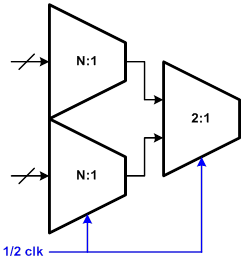
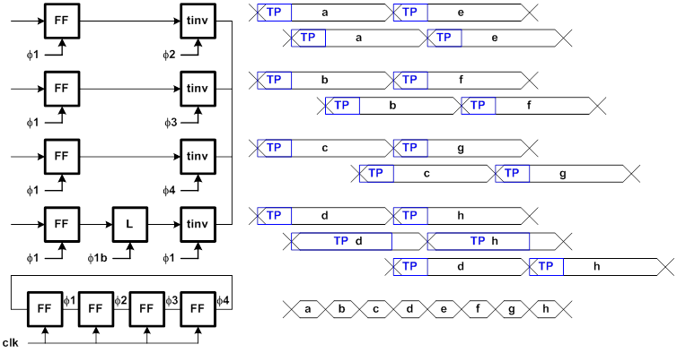
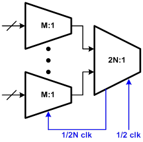
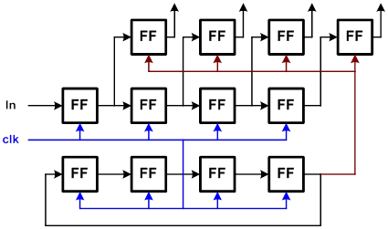
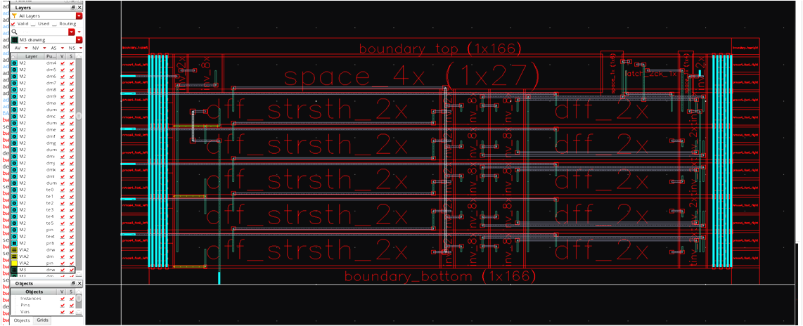
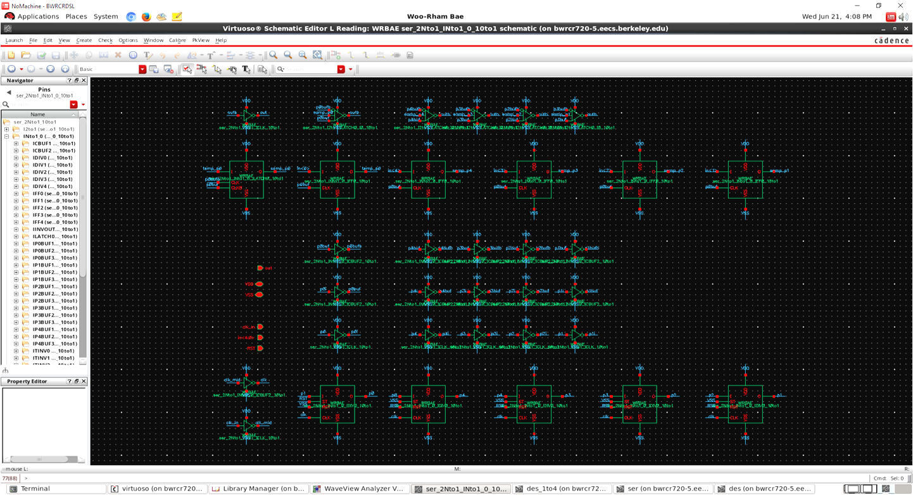
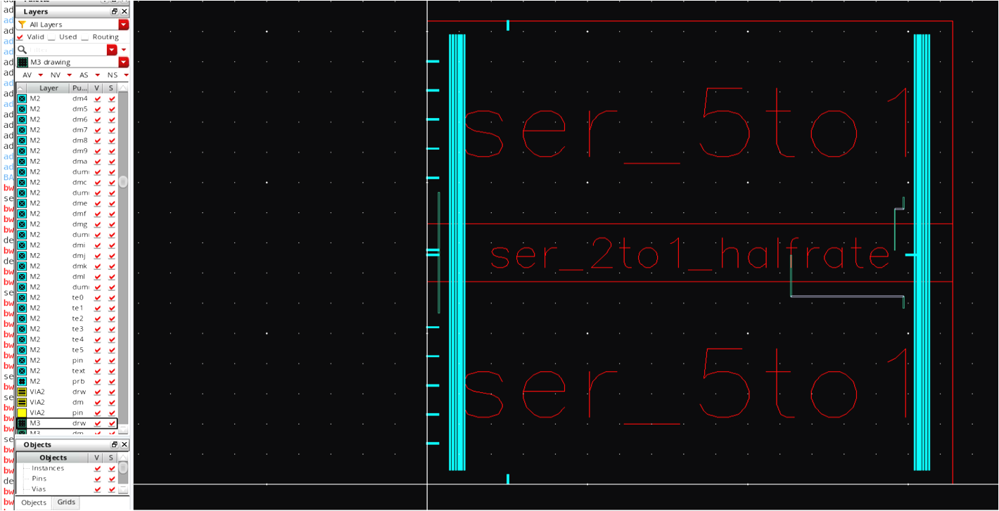
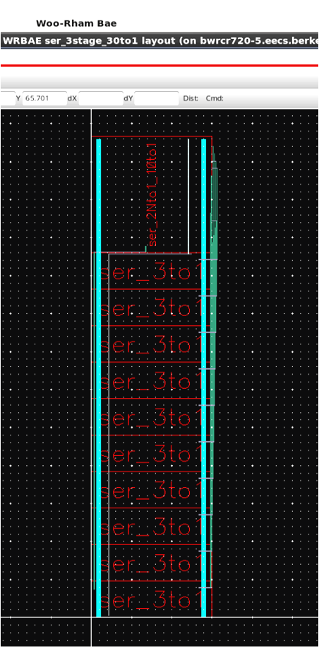
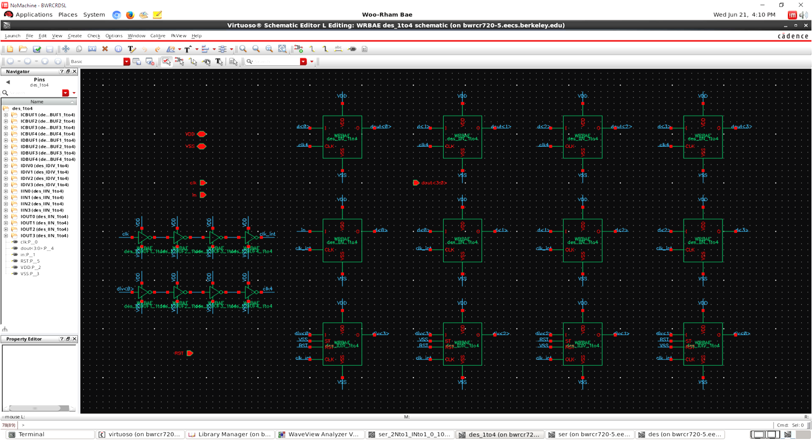

# CMOS SER/DES generator

This section describes how to generate CMOS SER/DES with a flexible SER/DES ratio.

## Structure
1) 2N:1 serializer

    

    * Assuming half-rate clocking
    * Two step: 2N:2, 2:1 for arbitrary N
    * Not 2:1 tree structure: more flexible SER ratio
2) N:1 serializer

    
    
    * Multi-phase divider using shift register
        * RESET signal required
        * One FF in divider reset to high, and the others reset to low  
    * Retiming flip-flops for the input
    * N:1 MUX using tri-state inverters
3) 2NM:1 serializer

    
    
    * 3 stage (2NM:2N:2:1)
    * For high serialization ratio
4) 1:N deserializer

    
    
    * Shift-register divider for arbitrary division ratio
        * First half of the FFs reset to high, and the rest of them reset to low
        * No narrow pulse from the divider
    * One stage: less speed limitation with increased division ratio unlike SER

## Setup (for BWRC users)

1) Clone main repo (tsmc16FFC).

    ```
    $ git clone git@bwrcrepo.eecs.berkeley.edu:erichang/craft_adc.git
    $ cd craft_adc
    $ git submodule init
    $ git submodule update
    ```

2) Clone laygo
    ```
    $ git clone git@github.com:ucb-art/laygo.git
    ```
3) Copy some files to your working directory (if you don't have them)
    ```
    cp /tools/projects/wrbae/serdes_test/craft_adc/serdes_spec.yaml .
    cp /tools/projects/wrbae/serdes_test/craft_adc/serdes_size.yaml .
    ln -s /tools/projects/jdhan/BAG/TISARADC_TSMC16FFC/tsmcN16_microtemplates_dense .
    cp /tools/projects/wrbae/serdes_test/craft_adc/laygo_config.yaml .
    ```
4) Open cds.lib and add
    ```
    DEFINE serdes_templates ./laygo/generators/serdes/serdes_templates
    ```
5) Open bag_libs.def and add
    ```
    serdes_templates $BAG_WORK_DIR/laygo/generators/serdes/BagModules
    and modify 'logic_templates' path to
    $BAG_WORK_DIR/laygo/generators/logic/BagModules
    ```
6) Open .cshrc_bag and comment out

    ```setenv BAG_PYTHON "/tools/projects/erichang/programs/anaconda3/bin/python"```

    and add
    
    ```setenv BAG_PYTHON "/tools/projects/eeis/BAG_2.0/anaconda2/bin/python"```
7) Open start bag.sh and comment out ```"set = cmd~~"``` and ```"exec $cmd~~"``` and add this
    
    ```exec ${BAG_PYTHON} -m IPython```
8) In virtuoso, create a new library called serdes_generated

## Serializer Generation

1) Set your SER parameters in serdes_spec.yaml and serdes_size.yaml
    * **num_ser**: 2Nto1 SER ratio, 2N = num_ser (even number only)
    * **num_ser_3rd**: 3rd stage SER ratio for 3-stage SER
    * **m_dff**: DFF size
    * **m_cbuf1**: Input clock buffer, first stage
    * **m_cbuf2**: Input clock buffer, second stage
    * **m_pbuf1**: Multiphase clock buffer, first stage
    * **m_pbuf2**: Multiphase clock buffer, second stage
    * **m_mux**: Tri-inv size
    * **m_out**: Output inv size
    * **m_ser**: 2to1 halfrate SER size
2) Generate N:1 SER

    a) Please note that num_ser in serdes_spec.yaml equals 2N
    
    b) Generate layout
    
        In BAG window, run laygo/generators/serdes/ser_layout_generator.py
    The layout shown below is for 5:1 serializer.

    

    c) Generate schematic
          
        run laygo/generators/serdes/ser_schematic_generator.py
    The schematic shown below is for 5:1 serializer.

    
3) Generate 2:1 SER with a half-rate clock

    a) Generate layout
    
        run laygo/generators/serdes/ser_2to1_halfrate_layout_generator.py

    b) Generate schematic
    
        run laygo/generators/serdes/ser_2to1_halfrate_schematic_generator.py
4) Generate 2N:1 SER

    a) Generate layout
    
        run laygo/generators/serdes/ser_2Nto1_layout_generator.py
    The layout shown below is for 10:1 serializer.

    
    b) Generate schematic
    
        run laygo/generators/serdes/ser_2Nto1_schematic_generator.py

### (Optional) Generate 3-stage SER for higher serialization ratio of M x 2N
1) Generate M:1 SER

    a) Open serdes_spec.yaml and set num_ser to 2M
    
    b) Generate layout of M:1 SER
    
        run laygo/generators/serdes/ser_layout_generator.py
2) Generate (M x 2N):1 SER

    a) Open serdes_spec.yaml. Return num_ser to 2N and set num_ser_3rd to M
        
    b) Generate layout
    
        run laygo/generators/serdes/ser_3stage_layout_generator.py
    The layout shown below is for 10:1 serializer.

    
    c) Generate schematic
    
        run laygo/generators/serdes/ser_3stage_schematic_generator.py

## Deserializer Generation

1) Set your DES parameters in serdes_spec.yaml and serdes_size.yaml
    * **num_des**: Deserialization ratio
    * **num_flop**: No. flops in a single column, for reducing layout height for higher N
    * **m_des_dff**: DFF size
2) Generate 1:N DES

    a) Open serdes_spec.yaml and set num_des and num_flop
    
        num_des = N, num_flop can be 1 or 2, num_flop adjusts the aspect ratio of the layout
        
    b) Generate layout
    
        run laygo/generators/serdes/des_layout_generator.py
        
    c) Generate schematic
    
        run laygo/generators/serdes/des_schematic_generator.py
        

The layout shown below is for 1:32 deserializer.


You can modify the aspect ratio of the layout by changing num_flop in serdes_spec.yaml.
(num_flop = 1 or 2) 


The schematic shown below is for 1:4 deserializer.


