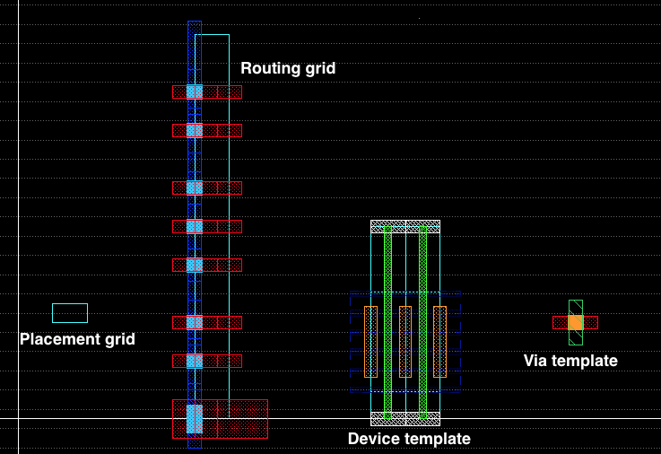
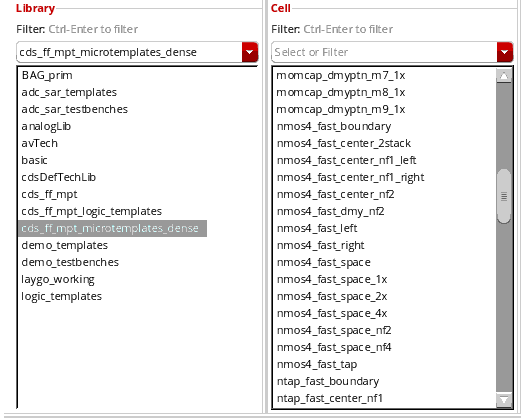
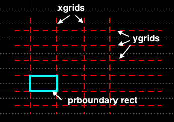
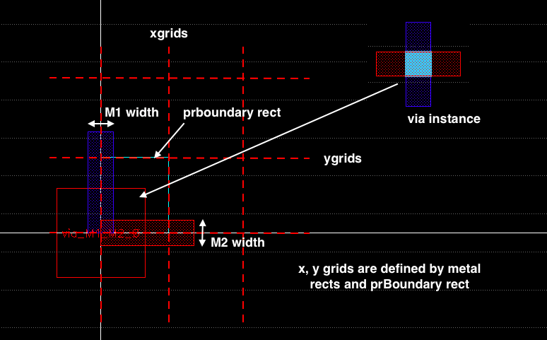
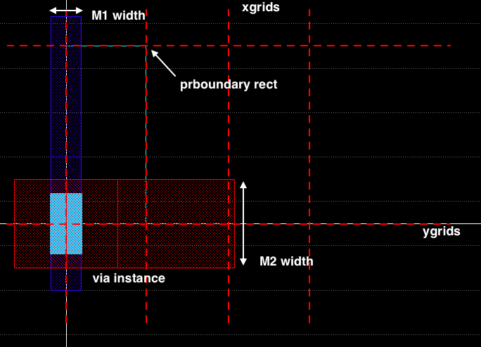
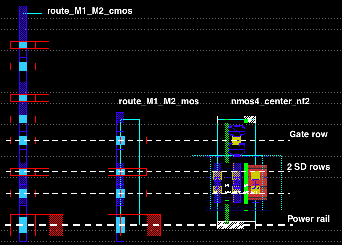
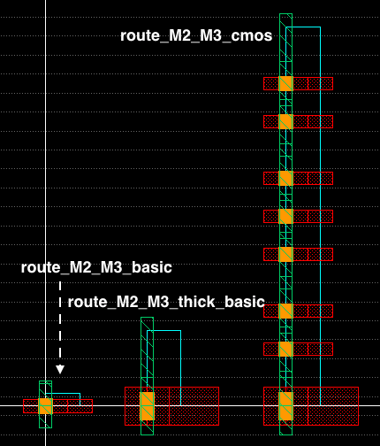
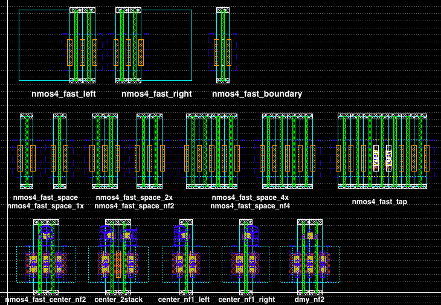

# Laygo setup for new technologies

This section describes how to setup laygo for a new technology.
This document is written to help users create setup files and template
libraries.

## Example setup files
Instead of starting from scratch, you can reuse some parts of example
files. Check the following repos for reference:

* cds_ff_mpt: [https://github.com/ucb-art/BAG2_cds_ff_mpt](https://github.com/ucb-art/BAG2_cds_ff_mpt)
* NCSU freePDK45: [https://github.com/ucb-art/BAG2_freePDK45](https://github.com/ucb-art/BAG2_freePDK45)

## Overview

Following items are need to be set up for laygo

* BAG
* config files: laygo_config.yaml, layermap file (GDS only)
* template and grid library: (tech_name)_microtemplates_dense
for most example generators, and associated yaml files

## BAG setup

Since BAG exports the generated layout to BAG (unless you are exporting
to GDS), you need to setup BAG before setting up laygo. Techinfo classes
related to XBase is not required, since BAG can use a dummy techinfo if
XBase is not set up for the technology in use.

## Config file (laygo_config.yaml)

Laygo uses **laygo_config.yaml** to store technology specific
information. For each technology, user need to create/update
**laygo_config.yaml** to contain correct parameters.
An example **laygo_config.yaml** file for **cds_ff_mpt**
technology is shown below.

```
#default_laygo_config file
metal_layers: #metal layers
- [M0, donotuse]
- [M1, drawing]
- [M2, drawing]
- [M3, drawing]
- [M4, drawing]
- [M5, drawing]
- [M6, drawing]
- [M7, drawing]
- [M8, drawing]
- [M9, drawing]
via_layers: #via layers
- [V0, donotuse]
- [V1, drawing]
- [V2, drawing]
- [V3, drawing]
- [V4, drawing]
- [V5, drawing]
- [V6, drawing]
- [V7, drawing]
- [V8, drawing]
pin_layers: #pin layers
- [text, drawing]
- [M1, pin]
- [M2, pin]
- [M3, pin]
- [M4, pin]
- [M5, pin]
- [M6, pin]
- [M7, pin]
- [M8, pin]
- [M9, pin]
prboundary_layer: [prBoundary, boundary] #boundary layer
tech_lib: cds_ff_mpt
text_layer: [text, drawing]
physical_resolution: 0.001
```

All fields need to filled in proper format, and contains information
explained below:

* **metal_layers** (list): list of [*layername*, *layerpurpose*]
 of metal layers to be used for routing, starting from the bottom
 layer to the top layer.
* **via_layers** (list): list of [*layername*, *layerpurpose*]
 of via layers to be used for routing, starting from the bottom
 layer to the top layer.
* **pin_layers** (list): list of [*layername*, *layerpurpose*]
 of pin layers to be used for routing, starting from the bottom
 layer to the top layer.
* **prboundary_layer** (list): list of [*layername*, *layerpurpose*]
 of the prBoundary layer for placement.
* **tech_lib** (str): name of technology.
* **text_layers** (list): list of [*layername*, *layerpurpose*]
 of the text layer for annotations.
* **physical_resolution** (float): minimum layout grid resolution in
micron. Most advanced nodes have grid resolutions ranging from 0.01
to 0.001.

## (tech_lib).layermap (GDS flow only)

For **GDS flow**, a separate layermap file is needed to map the layer
names to actual layer ids. Usually the layermap file is provided by
Foundry and can be found in the PDK library (because the file is used
to stream out a layout to a GDS file). Users can also try to make a
layermap file by themselves. Here's a example of the layermap file
(numbers are not from any real/generic PDKs). For **BAG flow** this file
is not needed.

```
#technology layer information for gds export
#you may find this in the cadence techlib directory
#layername layerpurpose stream# datatype
text        drawing 100 0
prBoundary  drawing 101 0
M1          drawing 1   0
M1          pin     1   1
M2          drawing 2   0
M2          pin     2   1
M3          drawing 3   0
M3          pin     3   1
M4          drawing 4   0
M4          pin     4   1
M5          drawing 5   0
M5          pin     5   1
M6          drawing 6   0
M6          pin     6   1
M7          drawing 7   0
M7          pin     7   1
M8          drawing 8   0
M8          pin     8   1
M9          drawing 9   0
M9          pin     9   1
VIA1        drawing 11   0
VIA2        drawing 12   0
VIA3        drawing 13   0
VIA4        drawing 14   0
VIA5        drawing 15   0
VIA6        drawing 16   0
VIA7        drawing 17   0
VIA8        drawing 18   0
```

## Template library

This is the most critical part for the setup. Laygo uses handcraft
templates of primitive devices for layout generations, meaning that
users need to build the template devices by themselves if not provided.
Basically there are 4 different cells to be created.

1. Placement grids: defines the grid resolutions that devices will
 be placed. **prboundary_layer** is used for setting the resolution.
2. Routing grids: defines the grid resolutions that routing wires
 and vias will be placed. Rects with **metal_layers** are used to
 define the width / spacing / coordinate of the routing grid.
3. Device template cells: templates of devices will be placed on one
 of the placement grids
4. Via template cells: templates of vias will be placed on one of
 the route grids.



Template and grid cell examples

**Multiple placement grids / routing grids / devices / vias** can be
defined for same technology / layer / device type. For example, users
can use 2 different types of grids (e.g thin and thick grids) for Metal1
and Metal2. Or 2 different set of NMOS templates (short channel and
long channel) can be defined. This gives a flexibility on generated
layout while still abstracting design rules.

The set of template / grid elements depends on user's preference, but
here are cells that need to be included to generate layout in the
example documentation.

#### Example template library name
For generator examples, (tech_lib)_microtemplates_dense is used for the
primitive template library name



#### Example placement grids
1. placement_basic : a default placement grid cell. **Contacted Poly
Pitch(CPO)** for the resolution in **x** direction and **fin
grid** or **contact pitch** is a good candidate for the
placement grid. Note that the size of any compatible templates
should be a multiple of the placement grid.

    

    placement_basic example

#### Example routing grids and vias
1. route_M1_M2_basic : a default M1_M2_route grid cell. **Minimum metal
spacings and widths** are used for the resolution and metal width.

    

2. route_M1_M2_basic_thick: an M1_M2 grid that is composed of
**thin** M1 and **thick** M2. This grid is useful for power grid routings.

    

3. route_M1_M2_mos, route_M1_M2_cmos : M2_M2 grids that are designed
to be compatible to NMOS/PMOS/CMOS stuctures. Note that grid coordinates
 are aligned to gate/drain/source pins of fets.

    

4. M2_M3 grids (route_M2_M3_basic, route_M2_M3_thick_basic,
route_M2_M3_cmos): M2_M3 grids that are compatible with M1_M2 grids.

    

5. Other grids on upper metal layers: following grids are used for
example generators.

    **M3_M4 grids**: route_M3_M4_basic, route_M3_M4_basic_thick,
    route_M3_M4_thick

    **M4_M5 grids**: route_M4_M5_basic, route_M4_M5_thick

    **M5_M6 grids**: route_M5_M6_basic, route_M5_M6_basic_thick,
    route_M5_M6_thick

#### Example mosfet templates

##### Basic idea

In order to nicely capture all boundary design rules, all mostfet row
structures are divided into 3 parts:

* Row boundary cells: placed at the (left & right) edges of device rows.
* Local boundary cells: placed between core devices
* Core cells: actual device cells (e.g. NF=2 NMOS, NF=1 NMOS, dummy NMOS, tap, ...)

Any device row can be constructed by combining those element cells into
one row.


For generator examples, these types of cells need to be implemented:
nmos4_fast, pmos4_fast, ntap_fast, ptap_fast

##### nmos4_fast family cells

Here are the list of nmos cells used in generator examples:

1. **nmos4_fast_left**: left boundary of nmos4_fast row
2. **nmos4_fast_right**: right boundary of nmos4_fast row
3. **nmos4_fast_boundary**: local boundary of nmos4_fast primitives
4. **nmos4_fast_space, nmos4_fast_space**: 1x spacing cells
5. **nmos4_fast_space_2x, nmos4_fast_space_nf2**: 2x spacing cells
6. **nmos4_fast_space_4x, nmos4_fast_space_nf4**: 4x spacing cells
7. **nmos4_fast_tap**: nmos4 tap cell
8. **nmos4_fast_center_nf2**: 2 finger nmos core
9. **nmos4_fast_center_nf2**: 2-stacked nmos core
10. **nmos4_fast_center_nf2**: 1 finger nmos core (gate left sided)
11. **nmos4_fast_center_nf2**: 1 finger nmos core (gate right sided)
12. **nmos4_fast_center_nf2**: 2 finger dummy nmos



##### pmos4_fast family cells

Equivalent pmos cells need to be implemented as well:

1. **pmos4_fast_left**: left boundary of pmos4_fast row
2. **pmos4_fast_right**: right boundary of pmos4_fast row
3. **pmos4_fast_boundary**: local boundary of pmos4_fast primitives
4. **pmos4_fast_space, pmos4_fast_space**: 1x spacing cell
5. **pmos4_fast_space_2x, pmos4_fast_space_nf2**: 2x spacing cells
6. **pmos4_fast_space_4x, pmos4_fast_space_nf4**: 4x spacing cells
7. **pmos4_fast_tap**: pmos4 tap cell
8. **pmos4_fast_center_nf2**: 2 finger pmos core
9. **pmos4_fast_center_nf2**: 2-stacked pmos core
10. **pmos4_fast_center_nf2**: 1 finger pmos core (gate left sided)
11. **pmos4_fast_center_nf2**: 1 finger pmos core (gate right sided)
12. **pmos4_fast_center_nf2**: 2 finger dummy pmos

##### ptap_fast family cells

Ptap cells are used for constructing a ptap row, in order to
construct thicker power grids (usually for pure analog cells)
 or guard rings.

1. **ptap_fast_left**: left boundary of ptap_fast row
1. **ptap_fast_right**: left boundary of ptap_fast row
1. **ptap_fast_boundary**: local boundary of ptap_fast row
1. **ptap_fast_center_nf2**: 2 finger ptap core
1. **ptap_fast_space**: 1x spacing cell
1. **ptap_fast_space_nf2**: 1x spacing cell
1. **ptap_fast_space_Nf4**: 1x spacing cell

##### ntap_fast family cells

Equivalent ntap cells need to be implemented as well:

1. **ntap_fast_left**: left boundary of ntap_fast row
1. **ntap_fast_right**: left boundary of ntap_fast row
1. **ntap_fast_boundary**: local boundary of ntap_fast row
1. **ntap_fast_center_nf2**: 2 finger ntap core
1. **ntap_fast_space**: 1x spacing cell
1. **ntap_fast_space_nf2**: 1x spacing cell
1. **ntap_fast_space_Nf4**: 1x spacing cell

#### Converting template layout to laygo database

After building those primitive templates, open bag and type

```
    run laygo/labs/lab2_a_gridlayoutgenerator_constructtemplate.py
```

It will read the primitive template layouts and construct template / grid
 databases and save them to the following 2 yaml files:

    * (tech_lib)_microtemplates_dense_templates.yaml
    * (tech_lib)_microtemplates_dense_grids.yaml