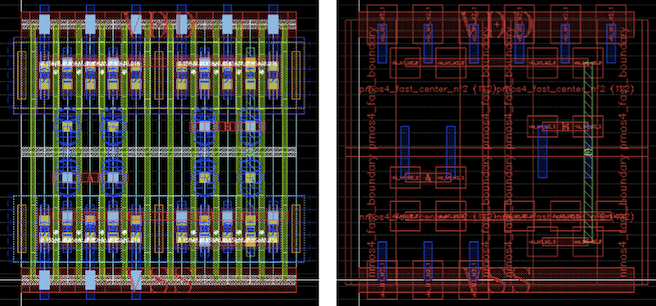
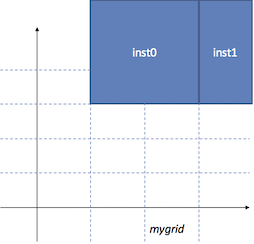
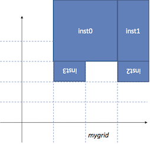
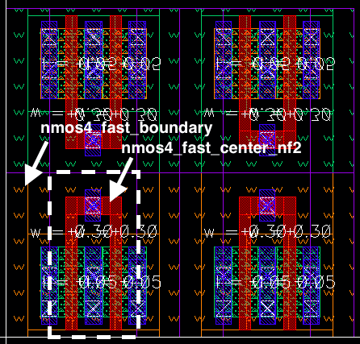
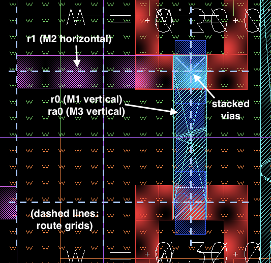

# NAND gate generation and BAG export tutorial

This tutorial contains instructions to generate a NAND gate layout and
export it to OA database through
[BAG](https://github.com/pkerichang/BAG_framework) framework. You can
simply run this tutorial by setting up BAG for
[cadence generic PDK for finfet and multi patterned technology](https://support.cadence.com)
and running [quick_start_BAG.py](../../../quick_start_BAG.py), but we
recommend users to go through the entire tutorial steps, reading this
document and running commands step by step, to get a better idea of the
laygo flow.

> Note: Although the rest of tutorial uses FreePDK45 for example, we
recommend using cds_ff_mpt because its BAG tech repository is maintained
continuously.

## Setup and running
Run following commands below to install laygo and load.

1. Download cds_ff_mpt PDK from [Cadence Customer Support](https://support.cadence.com)
Make sure you can launch virtuoso and make a layout using the PDK.
For BWRC users, PDK is installed in ```/tools/cadence/GPDK/cds_ff_mpt_v_0.3/```.

2. Clone BAG2_cds_ff_mpt repo.

    ```
    $ git clone git@github.com:ucb-art/BAG2_cds_ff_mpt.git
    ```

3. The technology setup repo has 2 submodules in it: BAG_framework and
laygo. Let's load the submodules. Enter the BAG_cds_ff_mpt
(or BAG2_cds_ff_mpt) directory and type this:

    ```
    $ git submodule init
    $ git submodule update
    ```

    * In order to update the submodules to the latest ones, type below:
    ```
    $ git submodule foreach git pull origin master
    ```


4. Open **.cshrc**, **bag_config.yaml** file, and check if all path
variables are set correctly. For BWRC users, all variables are set
correctly so skip this step.

5. Source .cshrc, launch virtuoso. Check if you can see all libraries
listed below.

    

    type ```load "start_bag.il"``` in CIW to load skill APIs for bag.

6. Launch bag, by typing this:

    ```
    $ start_bag.sh
    ```

7. Launch the generator script, by typing this in python console.

    ```python
    run laygo/quick_start_BAG.py
    ```

    You should see the generated nand gate layout in
    laygo_working/nand_test and it should looks like this:

    

## Initialize GridLayoutGenerator
Let's take a look into the detail of the layout generator.
Open laygo/quick_start_BAG.py
Following command will initialize GridLayoutGenerator, the main
generator object that contains all core generation functions.

```python
#initialize
laygen = laygo.GridLayoutGenerator(config_file="laygo_config.yaml")
laygen.use_array = True  # use InstanceArray instead of Instance
```

Note that **laygo_config.yaml** is passed, which contains process
specific information.
**use_array** is used to enable a recently added feature; InstanceArray.
Most legacy generator codes are not using this option.

## Load template and grid database
The example technology setup uses *cds_ff_mpt_microtemplates_dense*
for the primitive template library. All primitive template and grid
information are stored in *cds_ff_mpt_microtemplates_dense_templates.yaml*,
 *cds_ff_mpt_microtemplates_dense_grids.yaml*
and the files should be loaded before the actual layout generation steps.
Run the following commands to load database.

```python
# load template and grid
utemplib = laygen.tech + '_microtemplates_dense'  # device template library name
laygen.load_template(filename='./labs/' + utemplib + '_templates.yaml', libname=utemplib)
laygen.load_grid(filename='./labs/' + utemplib + '_grids.yaml', libname=utemplib)
laygen.templates.sel_library(utemplib)
laygen.grids.sel_library(utemplib)
```

**load_template** and **load_grid** functions load yaml files that store
template and grid database to laygen.templates and laygen.grid.
If you want to see the loaded information, run the following commands.

```
laygen.templates.display()
laygen.grids.display()
```

Or you can specify template (or grid name) to display, like this.

```python
laygen.templates.display(libname='cds_ff_mpt_microtemplates_dense', templatename='nmos4_fast_center_nf2')
laygen.grids.display(libname='cds_ff_mpt_microtemplates_dense', gridname='route_M1_M2_basic')
```

Then you can see the specified template and grid information, as shown
below.

```
Display lib:cds_ff_mpt_microtemplates_dense, template:nmos4_fast_center_nf2
[Library]cds_ff_mpt_microtemplates_dense
 [Template]nmos4_fast_center_nf2
 xy:[[0.0, 0.0], [0.4, 0.9]] pins:{'S0': {'netname': 'S0', 'layer': ['M1', 'pin'], 'xy': array([[-0.05,  0.2 ],
       [ 0.05,  0.5 ]])}, 'S1': {'netname': 'S1', 'layer': ['M1', 'pin'], 'xy': array([[ 0.35,  0.2 ],
       [ 0.45,  0.5 ]])}, 'D0': {'netname': 'D0', 'layer': ['M1', 'pin'], 'xy': array([[ 0.15,  0.2 ],
       [ 0.25,  0.5 ]])}, 'G0': {'netname': 'G0', 'layer': ['M1', 'pin'], 'xy': array([[ 0.125,  0.625],
       [ 0.275,  0.775]])}}
Display lib:cds_ff_mpt_microtemplates_dense, grid:route_M1_M2_basic
[Library]cds_ff_mpt_microtemplates_dense
 [Grid]route_M1_M2_basic
  route_M1_M2_basic width:0.2 height:0.2 xgrid:[ 0.] ygrid:[ 0.] xwidth:[ 0.1] ywidth:[ 0.1] viamap:{via_M1_M2_0: [0, 0] }
```

## Library and cell creation
The next step is creating a library and cell to work on.
Run the following commands to create a workspace.

```python
# library & cell creation
laygen.add_library('laygo_working')
laygen.add_cell('nand_test')
```

The commands will create library and cell to work on. In order to
display the contents, simply type ```laygen.display()```.
The output will be like this. (The nand_test is empty because we did not
create anything yet).

```
Display
[Library]laygo_working
 [Cell]nand_test
```

## Cell placements
The following commands will place 4 2-fingered transistors (2 nmos, 2 pmos)
and cluster them to 2 lists, nd and pd.

```python
# placement ########################################################################################################
# placement parameters
pg = 'placement_basic'  # placement grid

nd = [] # nmos
nd += [laygen.relplace(cellname='nmos4_fast_boundary', gridname=pg, refobj=None, shape=None)]
nd += [laygen.relplace(cellname='nmos4_fast_center_nf2', gridname=pg, refobj=nd[-1].right, shape=[1, 1])]
nd += [laygen.relplace(cellname='nmos4_fast_boundary', gridname=pg, refobj=nd[-1].right, shape=None)]
nd += [laygen.relplace(cellname='nmos4_fast_boundary', gridname=pg, refobj=nd[-1].right, shape=None)]
nd += [laygen.relplace(cellname='nmos4_fast_center_nf2', gridname=pg, refobj=nd[-1].right, shape=[1, 1])]
nd += [laygen.relplace(cellname='nmos4_fast_boundary', gridname=pg, refobj=nd[-1].right, shape=None)]
pd = [] # pmos
pd += [laygen.relplace(cellname='pmos4_fast_boundary', gridname=pg, refobj=nd[0].top, shape=None, transform='MX')]
pd += [laygen.relplace(cellname='pmos4_fast_center_nf2', gridname=pg, refobj=pd[-1].right, shape=[1, 1], transform='MX')]
pd += [laygen.relplace(cellname='pmos4_fast_boundary', gridname=pg, refobj=pd[-1].right, shape=None, transform='MX')]
pd += [laygen.relplace(cellname='pmos4_fast_boundary', gridname=pg, refobj=pd[-1].right, shape=None, transform='MX')]
pd += [laygen.relplace(cellname='pmos4_fast_center_nf2', gridname=pg, refobj=pd[-1].right, shape=[1, 1], transform='MX')]
pd += [laygen.relplace(cellname='pmos4_fast_boundary', gridname=pg, refobj=pd[-1].right, shape=None, transform='MX')]
```

**GridLayoutGenerator.replace** function places templates on grid,
using relative geometry information provided as arguments. Basically
there are 2 ways to place templates:

1. **xy**: with **xy** argument, the function places the
template (specified by templatename) at **xy** on grid, specified by
gridname. The default value is [0, 0].

    For example, the following command will place *inst0* (cellname is *mycell0*) at *[3, 1]*, on *mygrid*.
    ```python
    inst0 = laygen.relplace(cellname='mycell0', gridname='mygrid', xy=[1, 3])
    ```

    **transform** paramter is used for mirroring/rotation. For example, this
    command will do a mirrored placement in x-axis.
    ```python
    inst0 = laygen.relplace(cellname='mycell0', gridname='mygrid', xy=[1, 3], transform='MX')
    ```

    Possible **transform** parameters are **R0**, **R180**, **MX**, **MY**, and **MXY**.
    The following figure shows how instances are placed by running the above two commands.

    

2. **refobj**: You can use the **refobj** argument to specify the reference
object that the new object is placed from.

    Following objects can be used for the **refobj** argument.

    * **Instance / InstanceArray** : the new instance will be placed at the **right** side of **refobj**.

        For example, the following command will place inst1 (mycell1) at the right side of inst0, on mygrid.
        ```python
        #pseudo code. modify parameter values for actual use
        inst1 = laygen.relplace(cellname='mycell1', gridname='mygrid', refobj=inst0)
        ```

        

    * **Pointer** objects defined in **Instance / InstanceArray** : The **Instance**
    and **InstanceArray** objects have various Pointer objects to contain geometry information. The Pointers can
    be used for **refobj**. Supported **Pointer** objects are **left, right, top, bottom**.

        For example, the following command will place inst2 at the bottom side of inst1, mirrored in x-axis.
        ```python
        #pseudo code. modify parameter values for actual use
        inst2 = laygen.relplace(cellname='mycell2', gridname='mygrid', refobj=inst1.bottom)
        ```

        

You can also combine the two ways of placement. The following example will place inst3 at
 the right side of inst2, with [1, 0] offset on 'mygrid', mirrored in x-axis.
```python
#pseudo code. modify parameter values for actual use
inst3 = laygen.relplace(cellname='mycell3', gridname='mygrid', xy=[1, 0], refobj=inst2.right, transform='MX')
```



The way of architecting your templates completely depends on your preference.
The example generator codes assume **nmos4_fast_center_nf2** and
**pmos4_fast_center_nf2** templates are used for 2-fingered NMOS/PMOS devices, and
**nmos4_fast_boundary** and **pmos4_fast_boundary** templates for
boundary geometries for NMOS/PMOS devices.

The resulting layout should look like this.



If you want to display the layout, run the following command and open
**laygo/nand_test**.

```python
laygen.export_BAG(prj)
```

The **relplace** function has several arguments, explained below:

1. **shape** parameter sets the array dimension, for mosaic
placements. (eg. shape=[2, 3] will create a 2x3 dimensional array)
2. **spacing** parameter sets the 'pitch' of the array placement.
If None, laygo calculates the spacing parameter from the size of
template.
3. **direction** parameters sets the direction where the object
placed from (with respect to the reference instance). For example,
refinstname=X, direction='top' will place the new instance on top of
instance X. Possible values are **left**, **right**, **top**, and
**bottom**.
4. **transform** parameter sets the transformation of the instance.
Possible values are **R0**, **R180**, **MX**, **MY**, and **MXY**.

Refer to the API documentation for details.

## Signal routing
**GridLayoutGenerator.route** function is used for creating metal wires.
Like the **relplace** function, the route function can use xy0/xy1, and/or
 refobj0/refobj1. **route** uses two arguments for each type of input because
 the **route** needs to calculate the starting and ending point of wire.

This example creates a vertical and a horizontal route on grid. Layers are
automatically selected based on their routing directions.
```python
#pseudo code. modify parameter values for actual use
laygen.route(gridname0='myroutegrid', xy0=[2, 4], xy1=[2, 6]) #vertical
laygen.route(gridname0='myroutegrid', xy0=[2, 4], xy1=[5, 4]) #horizontal
```

This example shows a routing example using refobj (from A pin of inst0 to B pin of inst1).
```python
#pseudo code. modify parameter values for actual use
laygen.route(gridname0='myroutegrid', refobj0=inst0.pins['A'], refobj1=inst1.pins['B'])
```

As shown in the **relplace** section, the xy and refobj parameters can be combined.
```python
#pseudo code. modify parameter values for actual use
laygen.route(gridname0='myroutegrid', refobj0=inst0.pins['A'], xy0=[2, 1], refobj1=inst1.pins['B'], xy=[0, 1])
```

Let's go back to the real example. Running the following commands creates a rotated L shape route structure,
 stacked from M1 to M3, for one of the nand gate input.

```python
# a
laygen.route(gridname0=rg12, refobj0=nd[4].pins['G0'], refobj1=pd[4].pins['G0'], via1=[0, 0])
laygen.route(gridname0=rg12, xy0=[-2, 0], xy1=[0, 0], refobj0=pd[4].pins['G0'][0, 0], refobj1=pd[4].pins['G0'][-1, 0])
ra = laygen.route(gridname0=rg23, xy0=[0, 0], xy1=[0, 2], refobj0=pd[4].pins['G0'][0, 0], refobj1=pd[4].pins['G0'][0, 0], via0=[0, 0])
```

The first line creates a route from the **G0** pin of **nd[4]** (which is the second NMOS)
 to the **G0** pin of **pd[4]** (which is the second PMOS) on rg12, with an additional via placement at the end point.
 So this is basically connecting the gates of NMOS and PMOS.

The second line will create a horizontal route over the gate row, with a -2 offset at the starting point.
Since we already create the connecting vias in the first line, there's no need to add more vias.

The third line is creating the final vertical metal stub for the pin connection.

The generated routing pattern should look like this (if you run
**export_BAG**):



Running following commands will generate rest wire connections.

```python
# b
laygen.route(gridname0=rg12, refobj0=nd[1].pins['G0'], refobj1=pd[1].pins['G0'], via0=[0, 0])
laygen.route(gridname0=rg12, xy0=[0, 0], xy1=[2, 0], refobj0=nd[1].pins['G0'][0, 0], refobj1=nd[1].pins['G0'][-1, 0])
rb = laygen.route(gridname0=rg23, xy0=[0, 0], xy1=[0, 2], refobj0=nd[1].pins['G0'][0, 0], refobj1=nd[1].pins['G0'][0, 0], via0=[0, 0])
# internal connections
ri = laygen.route(xy0=[0, 1], xy1=[0, 1], gridname0=rg12, refobj0=nd[1].pins['D0'][0, 0],
                  refobj1=nd[4].pins['S1'][-1, 0])
for _p in np.concatenate((nd[1].pins['D0'], nd[4].pins['S0'], nd[4].pins['S1'])):
    laygen.via(xy=[0, 0], refobj=_p, gridname=rg12, overlay=ri)
# output
ron = laygen.route(gridname0=rg12, xy0=[-1, 0], xy1=[1, 0], refobj0=nd[4].pins['D0'][0, 0], refobj1=nd[4].pins['D0'][-1, 0])
rop = laygen.route(gridname0=rg12, xy0=[0, 0], xy1=[1, 0], refobj0=pd[1].pins['D0'][0, 0], refobj1=pd[4].pins['D0'][-1, 0])
laygen.via(refobj=nd[4].pins['D0'], gridname=rg12, overlay=ron)
laygen.via(refobj=pd[1].pins['D0'], gridname=rg12, overlay=rop)
laygen.via(refobj=pd[4].pins['D0'], gridname=rg12, overlay=rop)
ro = laygen.route(gridname0=rg23, refobj0=ron.right, refobj1=rop.right, xy0=[0, 0], xy1=[0, 0], via0=[0, 0], via1=[0, 0])
```


## Power routing
Power routing is very similar to signal routing. Run following commands
to creat power rail shapes.

```python
# power and ground route
for dev in [nd[1], pd[1], pd[4]]:
    for pn in ['S0', 'S1']:
        laygen.route(gridname0=rg12, refobj0=dev.pins[pn], refobj1=dev.bottom, direction='y', via1=[0, 0])
# power and groud rails
rvdd = laygen.route(gridname0=rg12, refobj0=pd[0].bottom_left, refobj1=pd[5].bottom_right)
rvss = laygen.route(gridname0=rg12, refobj0=nd[0].bottom_left, refobj1=nd[5].bottom_right)
```

## Pin creation
**GridLayoutGenerator.pin** function creates a pin and paste it to the
generated layout, like this.

```python
# pins
for pn, pg, pr in zip(['A', 'B', 'O', 'VDD', 'VSS'], [rg12, rg12, rg23, rg12, rg12], [ra, rb, ro, rvdd, rvss]):
laygen.pin(name=pn, gridname=pg, refobj=pr)
```

## Export to BAG
Running the following command will give a final layout exported in GDS
format.

```
# export
import bag
prj = bag.BagProject()
laygen.export_BAG(prj)
```

The resulting layout will look like this.


