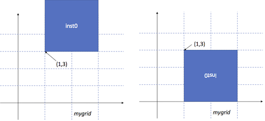
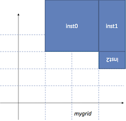

# NAND gate generation and GDS export tutorial

In this tutorial, you will create a simple NAND gate layout and export it to a GDS file.
The scripts used in this tutorial can be found in [quick_start_GDS.py](../../../quick_start_GDS.py).

## Setup
Run the following commands to install laygo and run ipython.

1. Clone laygo repo
    ```
    $ git clone git@github.com:ucb-art/laygo.git
    ```
2. Launch ipython (or bag)
    ```
    $ ipython
    ```
3. In ipython, import laygo and numpy
    ```python
    import laygo
    import numpy as np
    ```

>Note: if you just want to run
[quick_start_GDS.py](../../../quick_start_GDS.py) (not copy & pasting
codes in this document), first go into the laygo directory,
by typing 'cd laygo', and type 'run 'quick_start_GDS.py' to run the
script. This is because path variables in the scripts are referencing
laygo directory.

## Initialize GridLayoutGenerator
Run the following commands to initialize GridLayoutGenerator, the main
generator object that contains all layout generation functions.

```python
laygen = laygo.GridLayoutGenerator(config_file="./labs/laygo_config.yaml")
laygen.use_phantom = True  # for abstract generation. False when generating a real layout.
laygen.use_array = True  # use InstanceArray instead of Instance
```

Note that **use_phantom** tag is set to **True**, which means you are
exporting to a phantom cell. This option is useful for the GDS flow,
because in many cases you are not exporting the whole hierarchy to a
single GDS file. This option allows users to display the layout and
debug without exporting primitive templates.

**use_array** is used to enable a recently added feature; InstanceArray.
Most legacy generator codes are not using the option.

## Load template and grid database
The example technology setup uses *laygo_faketech_microtemplates_dense*
for the primitive template library. All primitive template and grid
information are stored in [labs/laygo_faketech_microtemplates_dense_templates.yaml](../../../labs/laygo_faketech_microtemplates_dense_templates.yaml),
[labs/laygo_faketech_microtemplates_dense_grids.yaml](../../../labs/laygo_faketech_microtemplates_dense_grids.yaml)
and the files need to be loaded before the actual layout generation steps.
Run the following commands to load template and grid database.

```python
# load template and grid
utemplib = laygen.tech + '_microtemplates_dense'  # device template library name
laygen.load_template(filename='./labs/' + utemplib + '_templates.yaml', libname=utemplib)
laygen.load_grid(filename='./labs/' + utemplib + '_grids.yaml', libname=utemplib)
laygen.templates.sel_library(utemplib)
laygen.grids.sel_library(utemplib)
```

**load_template** and **load_grid** functions read yaml files and dump
 to laygen.templates and laygen.grid.
The following commands shows the loaded template and grid information.

```
laygen.templates.display()
laygen.grids.display()
```

Or you can specify a template (or grid) to display, like the following:

```python
laygen.templates.display(libname='laygo_faketech_microtemplates_dense', templatename='nmos4_fast_center_nf2')
laygen.grids.display(libname='laygo_faketech_microtemplates_dense', gridname='route_M1_M2_basic')
```

Then you can see the specified template and grid information.

```
Display lib:laygo_faketech_microtemplates_dense, template:nmos4_fast_center_nf2
[Library]laygo_faketech_microtemplates_dense
 [Template]nmos4_fast_center_nf2
 xy:[[0.0, 0.0], [0.4, 0.9]] pins:{'S0': {'netname': 'S0', 'layer': ['M1', 'pin'], 'xy': array([[-0.05,  0.2 ],
       [ 0.05,  0.5 ]])}, 'S1': {'netname': 'S1', 'layer': ['M1', 'pin'], 'xy': array([[ 0.35,  0.2 ],
       [ 0.45,  0.5 ]])}, 'D0': {'netname': 'D0', 'layer': ['M1', 'pin'], 'xy': array([[ 0.15,  0.2 ],
       [ 0.25,  0.5 ]])}, 'G0': {'netname': 'G0', 'layer': ['M1', 'pin'], 'xy': array([[ 0.125,  0.625],
       [ 0.275,  0.775]])}}
Display lib:laygo_faketech_microtemplates_dense, grid:route_M1_M2_basic
[Library]laygo_faketech_microtemplates_dense
 [Grid]route_M1_M2_basic
  route_M1_M2_basic width:0.2 height:0.2 xgrid:[ 0.] ygrid:[ 0.] xwidth:[ 0.1] ywidth:[ 0.1] viamap:{via_M1_M2_0: [0, 0] }
```

## Library and cell creation
The next step is creating a library and cell to work on.
Run the following commands to create a workspace.

```python
# library & cell creation
laygen.add_library('laygo_working')
laygen.add_cell('nand_demo')
```

The commands will create library and cell to work on. In order to
display the contents, simply type ```laygen.display()```.
The output will be like this. (The nand_test is empty because we did not
create anything yet).

```
Display
[Library]laygo_test
 [Cell]nand_test
```

## Cell placements
The following commands will place 4 2-fingered transistors (2 nmos, 2 pmos)
and cluster them to 2 lists, nd and pd.

```python
# placement ########################################################################################################
# placement parameters
pg = 'placement_basic'  # placement grid

nd = [] # nmos
nd += [laygen.relplace(cellname='nmos4_fast_boundary', gridname=pg, refobj=None, shape=None)]
nd += [laygen.relplace(cellname='nmos4_fast_center_nf2', gridname=pg, refobj=nd[-1].right, shape=[1, 1])]
nd += [laygen.relplace(cellname='nmos4_fast_boundary', gridname=pg, refobj=nd[-1].right, shape=None)]
nd += [laygen.relplace(cellname='nmos4_fast_boundary', gridname=pg, refobj=nd[-1].right, shape=None)]
nd += [laygen.relplace(cellname='nmos4_fast_center_nf2', gridname=pg, refobj=nd[-1].right, shape=[1, 1])]
nd += [laygen.relplace(cellname='nmos4_fast_boundary', gridname=pg, refobj=nd[-1].right, shape=None)]
pd = [] # pmos
pd += [laygen.relplace(cellname='pmos4_fast_boundary', gridname=pg, refobj=nd[0].top, shape=None, transform='MX')]
pd += [laygen.relplace(cellname='pmos4_fast_center_nf2', gridname=pg, refobj=pd[-1].right, shape=[1, 1], transform='MX')]
pd += [laygen.relplace(cellname='pmos4_fast_boundary', gridname=pg, refobj=pd[-1].right, shape=None, transform='MX')]
pd += [laygen.relplace(cellname='pmos4_fast_boundary', gridname=pg, refobj=pd[-1].right, shape=None, transform='MX')]
pd += [laygen.relplace(cellname='pmos4_fast_center_nf2', gridname=pg, refobj=pd[-1].right, shape=[1, 1], transform='MX')]
pd += [laygen.relplace(cellname='pmos4_fast_boundary', gridname=pg, refobj=pd[-1].right, shape=None, transform='MX')]
```

**GridLayoutGenerator.replace** function places templates on grid,
using relative geometry information provided as arguments. Basically
there are 2 ways to place templates:

1. **xy**: with **xy** argument, the function places the
template (specified by templatename) at **xy** on grid, specified by
gridname. The default value is [0, 0].

    For example, the following command will place *inst0* (cellname is *mycell0*) at *[3, 1]*, on *mygrid*.
    ```python
    inst0 = laygen.relplace(cellname='mycell0', gridname='mygrid', xy=[1, 3])
    ```

    **transform** paramter is used for mirroring/rotation. For example, this
    command will do a mirrored placement in x-axis.
    ```python
    inst0 = laygen.relplace(cellname='mycell0', gridname='mygrid', xy=[1, 3], transform='MX')
    ```

    Possible **transform** parameters are **R0**, **R180**, **MX**, **MY**, and **MXY**.
    The following figure shows how instances are placed by running the above two commands.

    

2. **refobj**: You can use the **refobj** argument to specify the reference
object that the new object is placed from.

    Following objects can be used for the **refobj** argument.

    * **Instance / InstanceArray** : the new instance will be placed at the **right** side of **refobj**.

        For example, the following command will place inst1 (mycell1) at the right side of inst0, on mygrid.
        ```python
        inst1 = laygen.relplace(cellname='mycell1', gridname='mygrid', refobj=inst0)
        ```

        

    * **Pointer** objects defined in **Instance / InstanceArray** : The **Instance**
    and **InstanceArray** objects have various Pointer objects to contain geometry information. The Pointers can
    be used for **refobj**. Supported **Pointer** objects are **left, right, top, bottom**.

        For example, the following command will place inst2 at the bottom side of inst1, mirrored in x-axis.
        ```python
        inst2 = laygen.relplace(cellname='mycell1', gridname='mygrid', refobj=inst1.bottom)
        ```

        


The way to architect templates depends on user's preferences.
The example generator codes assume **nmos4_fast_center_nf2** and
**pmos4_fast_center_nf2** templates are used for 2-fingered NMOS/PMOS devices, and
**nmos4_fast_boundary** and **pmos4_fast_boundary** templates for
boundary geometries for NMOS/PMOS devices.

The resulting layout should look like this.


If you want to display the layout, run the following command and open
**output.gds** file. Note that actual NMOS/PMOS shapes are not shown
because they are abstracted.

```python
laygen.export_GDS('output.gds', cellname='nand_test', layermapfile="./laygo/labs/laygo_faketech.layermap")
```

The **relplace** function has several useful arguments, explained below:

1. **shape** parameter sets the array dimension, for mosaic
placements. (eg. shape=[2, 3] will create a 2x3 dimensional array).
Default value is [1, 1] and if **shape** is set to None, it will generate
a single instance. The difference between shape=[1, 1] and None is that
InstanceArray is generated for shape=[1, 1], while Instance is generated
for shape=None.
2. **spacing** parameter sets the 'pitch' of the array placement.
If None, laygo automatically calculates the spacing values from the size of
template.
3. **transform** parameter sets the transformation of the instance, as explained above.
Possible values are **R0**, **R180**, **MX**, **MY**, and **MXY**.

Refer to the laygo API documentation for details.

## Signal routing
Routing can be done by calling **route** commands. This routine creates
a 180-degree rotated L shaped route, stacked from M1 to M3, for one of
the nand gate input.

```python
#a
laygen.route(None, xy0=[0, 0], xy1=[0, 0], gridname0=rg_m1m2, refinstname0=prow[4].name, refpinname0='G0',
             via0=[[0, 0]], refinstname1=nrow[4].name, refpinname1='G0')
laygen.route(None, xy0=[-2, 0], xy1=[0, 0], gridname0=rg_m1m2, refinstname0=prow[4].name, refpinname0='G0',
             refinstname1=prow[4].name, refpinname1='G0')
ra0 = laygen.route(None, xy0=[0, 0], xy1=[0, 2], gridname0=rg_m2m3,refinstname0=prow[4].name, refpinname0='G0',
                   refinstname1=prow[4].name, refpinname1='G0', via0=[[0, 0]], endstyle0="extend", endstyle1="extend")
```

The generated routing pattern should look like this:


Note that **refinstname** and **refpinname** are used to describe instance
and pin related geometries for the routing, and **via0** and **via1**
parameters are used to place via abut to the route objects.

Running following commands will generate wire connections.

```python
#b
laygen.route(None, xy0=[0, 0], xy1=[0, 0], gridname0=rg_m1m2, refinstname0=nrow[1].name, refpinname0='G0',
             via0=[[0, 0]], refinstname1=prow[1].name, refpinname1='G0')
laygen.route(None, xy0=np.array([0, 0]), xy1=[2, 0], gridname0=rg_m1m2, refinstname0=nrow[1].name, refpinname0='G0',
             refinstname1=nrow[1].name, refpinname1='G0')
rb0 = laygen.route(None, xy0=[0, 0], xy1=[0, 2], gridname0=rg_m2m3,refinstname0=nrow[1].name, refpinname0='G0',
                   refinstname1=nrow[1].name, refpinname1='G0', via0=[[0, 0]], endstyle0="extend", endstyle1="extend")
#internal connections
laygen.route(None, xy0=[0, 1], xy1=[0, 1], gridname0=rg_m1m2, refinstname0=nrow[1].name, refpinname0='D0',
             refinstname1=nrow[4].name, refpinname1='S1', via0=[[0, 0]], via1=[[-2, 0], [0, 0]])
#output
laygen.route(None, xy0=[0, 1], xy1=[1, 1], gridname0=rg_m1m2, refinstname0=prow[1].name, refpinname0='D0',
             refinstname1=prow[4].name, refpinname1='D0', via0=[[0, 0]], via1=[[-1, 0]])
laygen.route(None, xy0=[-1, 0], xy1=[1, 0], gridname0=rg_m1m2, refinstname0=nrow[4].name, refpinname0='D0',
             refinstname1=nrow[4].name, refpinname1='D0', via0=[[1, 0]])
ro0 = laygen.route(None, xy0=[1, 0], xy1=[1, 1], gridname0=rg_m2m3,refinstname0=nrow[4].name, refpinname0='D0',
                   via0=[[0, 0]], refinstname1=prow[4].name, refpinname1='D0', via1=[[0, 0]])
```


## Power routing
Power routing is very similar to signal routing. Run following commands
to creat power rail shapes.

```python
# power and ground vertical route
for s in ['S0', 'S1']:
    xy_s0 = laygen.get_template_pin_coord(nrow[1].cellname, s, rg_m1m2)[0, :]
    laygen.route(None, laygen.layers['metal'][1], xy0=xy_s0 * np.array([1, 0]), xy1=xy_s0, gridname0=rg_m1m2,
                 refinstname0=nrow[1].name, via0=[[0, 0]], refinstname1=nrow[1].name)
    laygen.route(None, laygen.layers['metal'][1], xy0=xy_s0 * np.array([1, 0]), xy1=xy_s0, gridname0=rg_m1m2,
                 refinstname0=prow[1].name, via0=[[0, 0]], refinstname1=prow[1].name)
    laygen.route(None, laygen.layers['metal'][1], xy0=xy_s0 * np.array([1, 0]), xy1=xy_s0, gridname0=rg_m1m2,
                 refinstname0=prow[4].name, via0=[[0, 0]], refinstname1=prow[4].name)
# power and ground rails
xy = laygen.get_template_size(nrow[5].cellname, rg_m1m2) * np.array([1, 0])
rvdd=laygen.route(None, laygen.layers['metal'][2], xy0=[0, 0], xy1=xy, gridname0=rg_m1m2,
                  refinstname0=prow[0].name, refinstname1=prow[5].name)
rvss=laygen.route(None, laygen.layers['metal'][2], xy0=[0, 0], xy1=xy, gridname0=rg_m1m2,
                  refinstname0=nrow[0].name, refinstname1=nrow[5].name)
```

After finishing the route, your layout will look like this:


## Pin creation
**GridLayoutGenerator.pin** function creates a pin and paste it to the
generated layout. The function gets xy as arguments for pin coordinates,
possibly provided from calling **get_rect_xy** function and providing the
rect object that you want to create the pin over as an argument. Run the
 following commands.

```python
# pins
laygen.pin(name='A', layer=laygen.layers['pin'][3], xy=laygen.get_rect_xy(ra0.name, rg_m2m3), gridname=rg_m2m3)
laygen.pin(name='B', layer=laygen.layers['pin'][3], xy=laygen.get_rect_xy(rb0.name, rg_m2m3), gridname=rg_m2m3)
laygen.pin(name='O', layer=laygen.layers['pin'][3], xy=laygen.get_rect_xy(ro0.name, rg_m2m3), gridname=rg_m2m3)
laygen.pin(name='VDD', layer=laygen.layers['pin'][1], xy=laygen.get_rect_xy(rvdd.name, rg_m1m2), gridname=rg_m1m2)
laygen.pin(name='VSS', layer=laygen.layers['pin'][1], xy=laygen.get_rect_xy(rvss.name, rg_m1m2), gridname=rg_m1m2)
```

## GDS export
Running the following command will give a final layout exported in GDS
format.

```
# GDS export
laygen.export_GDS('output.gds', cellname='nand_test', layermapfile="./laygo/labs/laygo_faketech.layermap")
```

The resulting layout will look like this.

